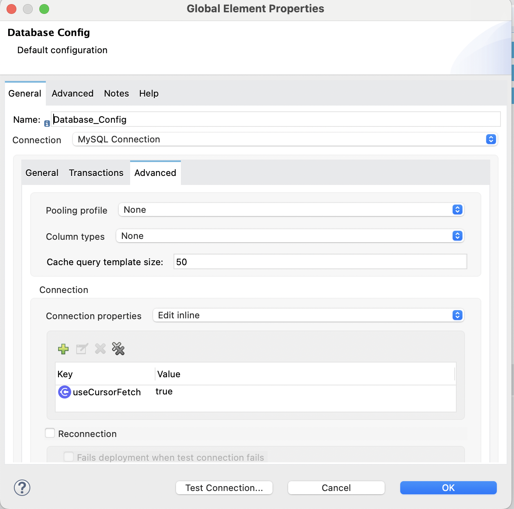

# Mule Streaming DB (Large ResultSet)

## Description
This Mule application designed to facilitate real-time streaming of database records, processing them as per the defined logic, and subsequently storing the processed data into a local CSV file. This application is ideal for data migration tasks, reporting, or backing up database records in a universally accessible format.

## Getting Started

### Dependencies
- Mule 4 runtime engine (tested with 4.5.3)
- Anypoint Studio 7 or later (tested with 7.16)
- MySQL Connector/J for database connection (version 8.0.30)
- Java JDK 8 (used AdoptOpenJDK 1.8.292)

### Installing
Import the project into your Anypoint Studio, follow these steps:

1. Clone the repository to your local machine:

```git clone https://github.com/pedes/mule-stream-db-large-resultset.git```

2. Open Anypoint Studio and import the cloned project:
- Select `File` > `Import` > `Anypoint Studio` > `Anypoint Studio project from File System`.
- Navigate to the project directory and select the project.
3. Ensure that the Mule runtime engine is set to at least version 4.5.3

### Configuration
Before running the application, configure the following:

1. Database connection:
- If required, spin up a docker container with a large database, recommended to use this:
https://hub.docker.com/r/andrespedes/mysql-large-sample-db


- Edit the `src/main/resources/application.properties` file to include your database connection properties (URL, user, password).
2. Output CSV file path:
- Edit the property for file path `destination.file.path` .
3. Enable streaming in your database engine
- **MySQL**: Requires 2 settings, a connection property `useCursorFetch = true` and the `fetchSize` set to a certain number, e.g. 100, 1000

**CAUTION**
> In order to enable Streaming in MySQL this has to be enabled at the connection level. In the Database Config element, this:
> 
> More info:
> 
> 
> https://dev.mysql.com/doc/connector-j/en/connector-j-reference-implementation-notes.html
> 
> https://dev.mysql.com/doc/connector-j/en/connector-j-reference-configuration-properties.html

- **Oracle**: Easier than MySQL, Oracle JDBC drivers support fetching rows in batches, which can help manage memory usage when dealing with large result sets, the database operation `fetchSize` is the number of rows to fetch with each round trip to the database.
- **PostgreSQL**: the JDBC driver supports setting a fetch size that controls how many rows are fetched in one batch, similar to Oracle. Set the `connection's auto-commit to false`, and `setFetchSize()` with the desired number of rows to fetch per round trip.

## Usage
To use the application, simply run it from Anypoint Studio:
- Invoke the flow for streaming database records with a simple GET request
- `curl http://localhost:8081/db-large-stream-csv` 

## Findings/Testing Results
- The select operation could be configured as non repeatable stream OR repeatable file-stored iterable.
- Non-repeatable stream gives the best performance, useful in many cases.
- The app doesn't need more than 200-300Mb of RAM/Heap to process large amounts of data.
- Streaming configuration depends on the Database Engine, MySQL and Microsoft SQL Server are the ones that require more specialized config.


```
wc -l result.csv
2844048 result.csv

15 seconds to process 2.8 million records
INFO  2024-02-14 17:30:53,473 
INFO  2024-02-14 17:31:08,746

File stored repeatable stream (10000 fetch size 10K, 29s)
INFO  2024-02-14 17:25:06,257 
INFO  2024-02-14 17:25:35,390 
```

## Contributing
Contributions are welcome! If you have any improvements or bug fixes, please fork the repository and submit a pull request.

## Versioning
We use [SemVer](http://semver.org/) for versioning. For the versions available, see the [tags on this repository](https://github.com/pedes/mule-stream-db-large-resultset/tags).

## Authors
- **Andres Cespedes Morales**

## License
This project is licensed under the Apache 2.0 License; see the [tab](https://github.com/pedes/mule-stream-db-large-resultset?tab=Apache-2.0-1-ov-file) for details.
